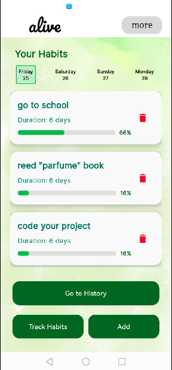
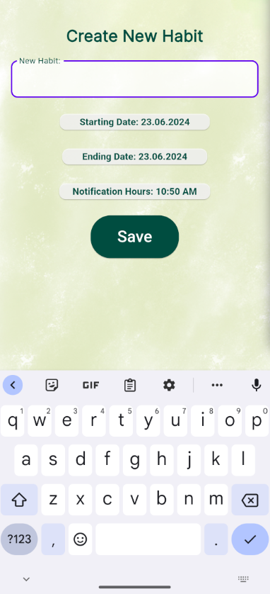
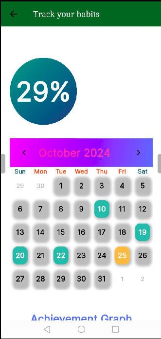
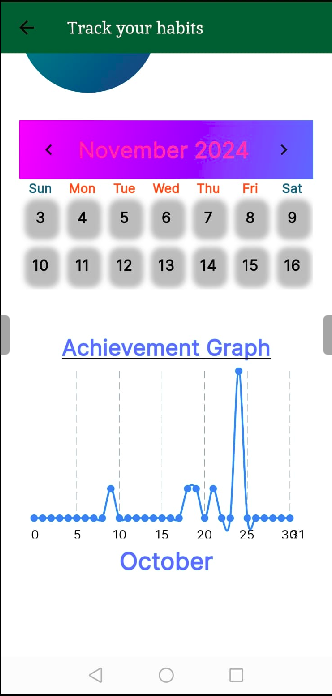
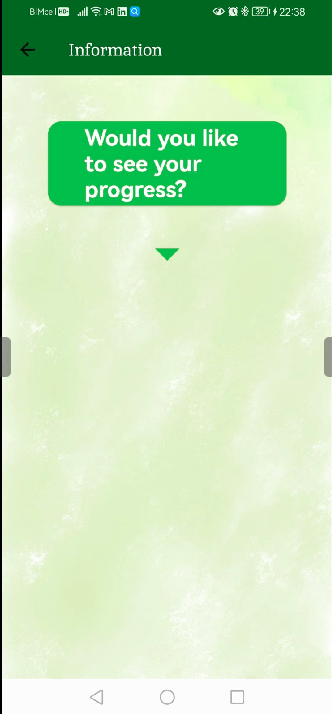
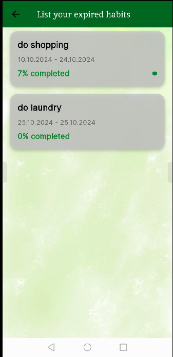

# alive mobile app

This is a habit tracking mobile app. People can easily track their abilities throughout the day and month. 

The aim of the app is to easily build habits. The logic of using the app is very simple; the habit is added, the day and time are set and confirmed within this period.  
 
### How to start project? 
- ```flutter run <emulatorname>```
- ``` flutter run ```


### System requirements

* Dart SDK Version 2.18.0 or greater.
* Flutter SDK Version 3.3.0 or greater.


### Check the UI of the entire app

Check the UI of all the app screens from a single place by setting up the 'initialRoute'  to AppNavigation in the AppRoutes.dart file.

### Application structure
After successful build, your application structure should look like this:
                    
```
.
├── android                         - It contains files required to run the application on an Android platform.
├── assets                          - It contains all images and fonts of your application.
├── ios                             - It contains files required to run the application on an iOS platform.
├── lib                             - Most important folder in the application, used to write most of the Dart code..
    ├── main.dart                   - Starting point of the application
    ├── core
    │   ├── app_export.dart         - It contains commonly used file imports
    │   ├── constants               - It contains static constant class file
    │   └── utils                   - It contains common files and utilities of the application
    ├── presentation                - It contains widgets of the screens
    ├── routes                      - It contains all the routes of the application
    └── theme                       - It contains app theme and decoration classes
    └── widgets                     - It contains all custom widget classes
          ├── notification.dart     - It contains all notification settings
```
### How to format your code?

- if your code is not formatted then run following command in your terminal to format code
  ```
  dart format .
  ```

### How you can improve code readability?

Resolve the errors and warnings that are shown in the application.

### Fonts
We were unable to find the following Fonts, Please add manually to ```assets/fonts``` 

```
jsMathcmbx10.ttf
```

```
google fonts
```


## images of mobile pages 

<div style="display: flex; flex-wrap: wrap; padding: 10px; margin: 0; justify-content: space-around;">
    <div style="display: flex; justify-content: space-around; width: 100%;">
        
        
        
    </div>
    <div style="display: flex; justify-content: space-around; width: 100%;">
        
        
        
    </div>
    <div style="display: flex; justify-content: space-around; width: 100%;">
        
    </div>
</div>